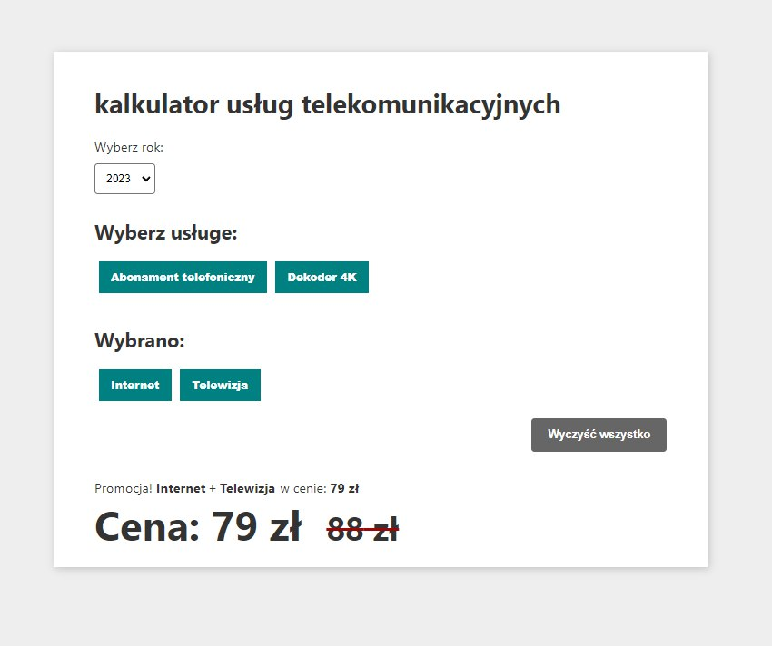

# Recruitment task for ideo.pl
## Telecommunications price calculator



## Clear and easy to modify
    ✓ Add another product
    ✓ Price change
    ✓ Adding more years
    ✓ Ready for further development

## features
    ✓ Rebate,
    ✓ Ability to combine in packages,
    ✓ You cannot add a product that depends on others

## Structure of server
    in custom hook useGetData you can find URL
    Here you can add check for available years from the server

```ts
const getData = async () => {
    if (year) try {
        const value = await fetch(`./exampleserver/${year}.json`);
        const decodedValue = await value.json();
        setData(decodedValue);
    } catch (error) {
        setData(null);
    }
};
```

The url contains the year option, where each year is a separate array of data


# Structure of data:
### **Services:**
The array contains: "**name**", "**id**", "**price**".


**ID** : is a universal identifier that cannot be repeated 2 times.

In the required **ID**, specify the services that you can't select this service without.

```json
"services": [
    {
        "name": "Internet",
        "id": 11,
        "price": 39
    },
    {
        "name": "Telewizja",
        "id": 22,
        "price": 49
    },
    {
        "name": "Abonament telefoniczny",
        "id": 33,
        "price": 29
    },
    {
        "name": "Dekoder 4K",
        "id": 44,
        "price": 29,
        "requiredId": [
            22
        ]
    }
],
```

### **Packages:**
 This array assigns the specified price to all id's.
 
 If all **IDs** from the array are selected, the calculator will calculate this discount and count it if it is the most profitable for the buyer.

 In these id fields you need to place the id from the services array.
```json
"packages": [
    {
        "id": [
            11,
            22
        ],
        "price": 79
    },
    {
        "id": [
            11,
            33
        ],
        "price": 64
    }
],
```

### **Special offer:**
This array assigns the specified price to only one **id**.

 If all **include IDs** from the array are selected, the calculator will calculate this discount and count it if it is the most profitable.

 In these id fields you need to place the id from the services array.
```json
"specialOffer": [
    {
        "id": 44,
        "requiredId": [
            11,
            22
        ],
        "price": 0
    }
]
```

# Ready for further development
### Global state created by **useContext()** [Learn More](https://react.dev/reference/react/useContext)
### In the global state of the application, you can use functions and variables such as:
```ts
getSelectServices: {
    selectedServicesId: number[];
    addServices: (arrayWithId: number[]) => void;
    removeService: (index: number) => void;
    clearSelectedServices: () => void;
    setIsAnyRequiredService: React.Dispatch<boolean>;
    isAnyRequiredService: boolean;
};
getData: {
    data: Data;
    year: string;
    setYear: React.Dispatch<React.SetStateAction<string>>;
    findServiceById: (id: number) => {
        name: string;
        id: number;
        price: number;
        includeId?: number[] | undefined;
    } | undefined;
};
getCount: {
    price: number;
    discountPrice: number;
    findDiscountNamesAndPrice: () => {
        names: string[];
        price: number;
    } | undefined;
```

### Example of setting the year using the setYear function in the getData section
```ts
const SelectYear = () => {
    const { getData } = useContext(CalculatorContext);

    const { setYear } = getData;

    return (
        <select onChange={(e) => setYear(e.currentTarget.value)}>
            <option value={"2023"}>2023</option>
            <option value={"2024"}>2024</option>
            <option value={"2025"}>2025</option>
            <option value={"2026"}>2026</option>
        </select>
    );
};
```
# Getting Started with Create React App

This project was bootstrapped with [Create React App](https://github.com/facebook/create-react-app).

## Available Scripts

In the project directory, you can run:

### `npm start`

Runs the app in the development mode.\
Open [http://localhost:3000](http://localhost:3000) to view it in the browser.

The page will reload if you make edits.\
You will also see any lint errors in the console.

### `npm run build`

Builds the app for production to the `build` folder.\
It correctly bundles React in production mode and optimizes the build for the best performance.

The build is minified and the filenames include the hashes.\
Your app is ready to be deployed!

See the section about [deployment](https://facebook.github.io/create-react-app/docs/deployment) for more information.

### `npm run eject`

**Note: this is a one-way operation. Once you `eject`, you can’t go back!**

If you aren’t satisfied with the build tool and configuration choices, you can `eject` at any time. This command will remove the single build dependency from your project.

Instead, it will copy all the configuration files and the transitive dependencies (webpack, Babel, ESLint, etc) right into your project so you have full control over them. All of the commands except `eject` will still work, but they will point to the copied scripts so you can tweak them. At this point you’re on your own.

You don’t have to ever use `eject`. The curated feature set is suitable for small and middle deployments, and you shouldn’t feel obligated to use this feature. However we understand that this tool wouldn’t be useful if you couldn’t customize it when you are ready for it.

## Learn More

You can learn more in the [Create React App documentation](https://facebook.github.io/create-react-app/docs/getting-started).

To learn React, check out the [React documentation](https://reactjs.org/).
